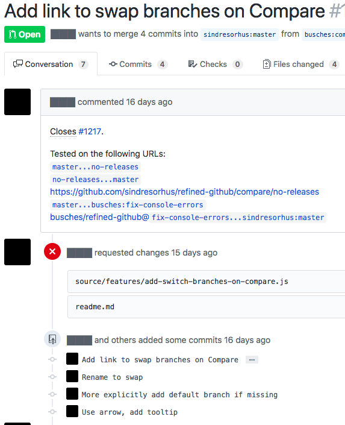
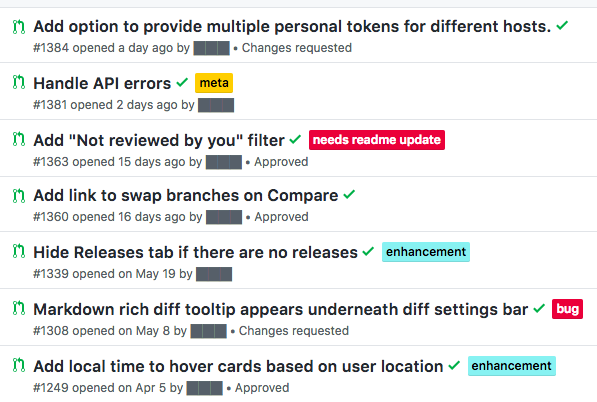

Blind Review
============
A browser extension to help perform unbiased reviews of pull requests.

We all have our own code review biases, whether we admit it or not. 
- "This person always writes good code, I'm just going to merge it" 
- "I better go over this thoroughly because this person screwed things up last time"
- "This was written by a person way smarter than me, I better just approve, they know what they are doing"
- "This person destroyed my last PR, I am going to nitpick the hell out of theirs"

The goal of this extension is to relieve you, the pull-request reviewer, of your known and unknown biases.
Treat the code **as the code**, no matter who wrote it.

It is easy enough to see who made comments or created the Pull Request by hovering or clicking on the redacted name or image, so fear not, you will not be completely in the dark.. which is especially useful if you need to @message someone. Perhaps in future versions there will be levels of obscuring.

Take it for a spin and see how it changes your view of your peers work.

Building
--------
- `npm run build` - point Chrome at the `distribution/` directory
- `npm run watch` - dev mode

Screenshots
-----------

Shoutouts
---------
- Framework for building borrowed from https://github.com/sindresorhus/refined-github

Related
-------
- Gender differences and bias in open source: Pull request acceptance of women versus men
    - https://news.ycombinator.com/item?id=11074587
    - https://peerj.com/preprints/1733/

